# Conclusiones del Análisis de Datos - Machine Learning

**Dataset:** Total_Mes_Act_Datos completos CORREGIDO.csv  
**Total de registros:** 1,048,575 filas, 36 columnas  
**Separador:** Punto y coma (`;`)

---

## Resumen Ejecutivo

Se realizó un análisis completo de machine learning para predecir si un registro cumple con los criterios de tener información tanto en **TARIFA_NBO** como en **Rentabilizo**. Se evaluaron tres modelos: Regresión Logística, Random Forest y XGBoost, con análisis exhaustivo de importancia de variables, visualizaciones EDA y árboles de decisión.

### Variable Objetivo

- **Criterio:** Variable binaria donde:
  - **1** = Ambos campos (TARIFA_NBO y Rentabilizo) tienen información (no nulos)
  - **0** = No cumplen ambos criterios

- **Distribución:**
  - Clase 1 (cumplen criterios): 201,314 registros (19.20%)
  - Clase 0 (no cumplen criterios): 847,261 registros (80.80%)

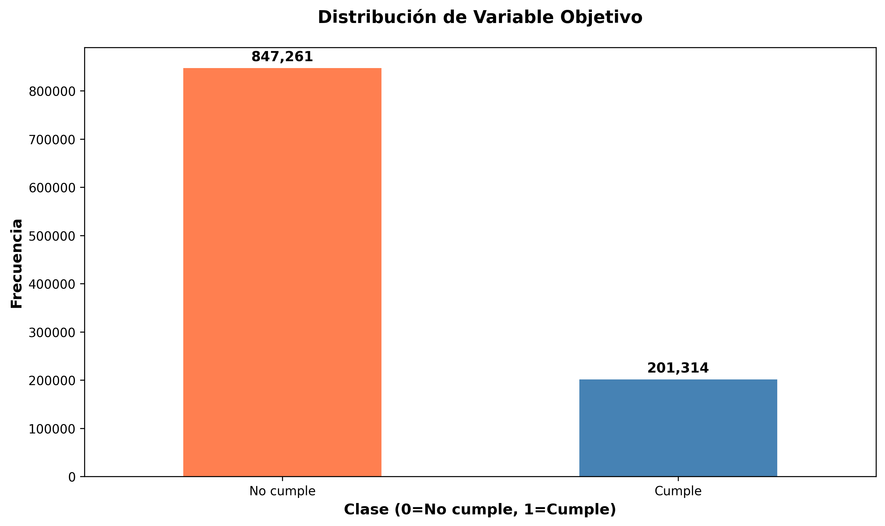

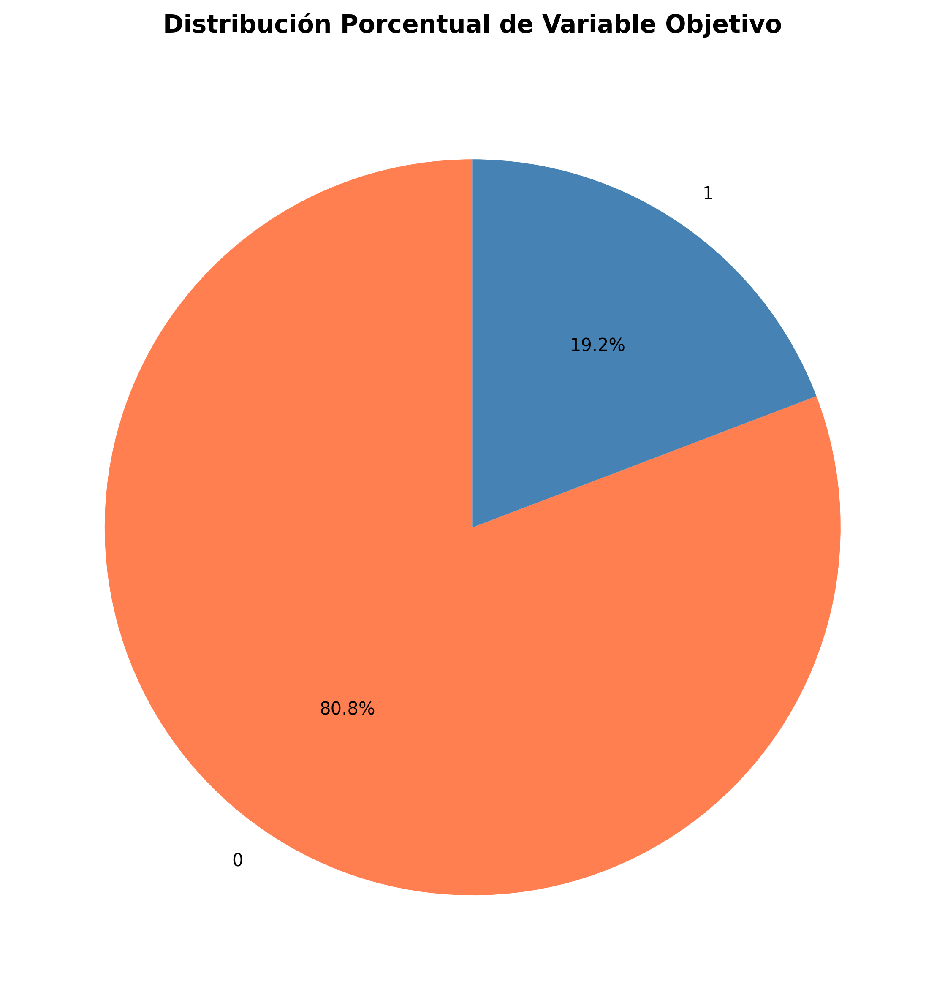

---

## Análisis Exploratorio de Datos (EDA)

### Características del Dataset

- **Dimensiones:** 1,048,575 filas × 36 columnas
- **Tipos de datos:**
  - Object: 29 columnas
  - Int64: 5 columnas
  - Float64: 2 columnas
- **Columnas numéricas identificadas:** 7

### Valores Faltantes

Los principales valores faltantes identificados:

- **Rentabilizo:** 78.89% faltantes
- **MSH_JEFE:** 52.25% faltantes
- **MSH_LOGIN_ID:** 37.69% faltantes
- **TARIFA_NBO:** 7.22% faltantes

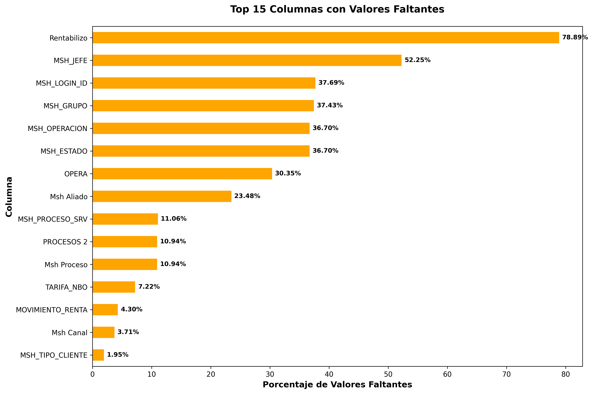

### Visualizaciones EDA

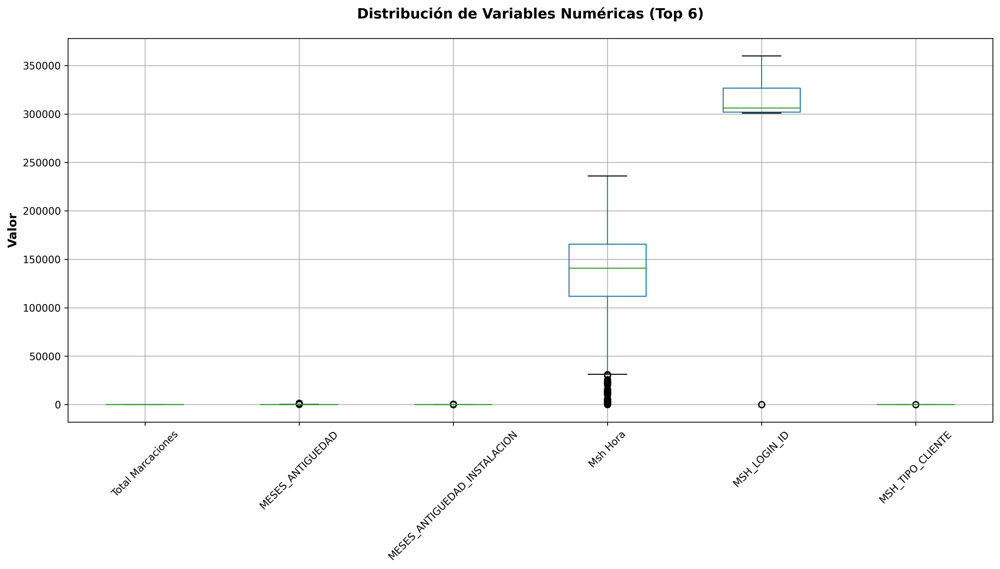

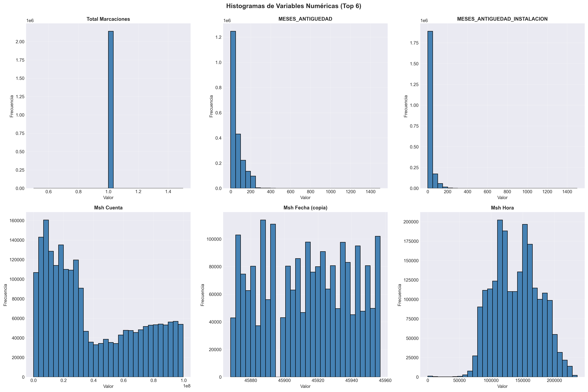

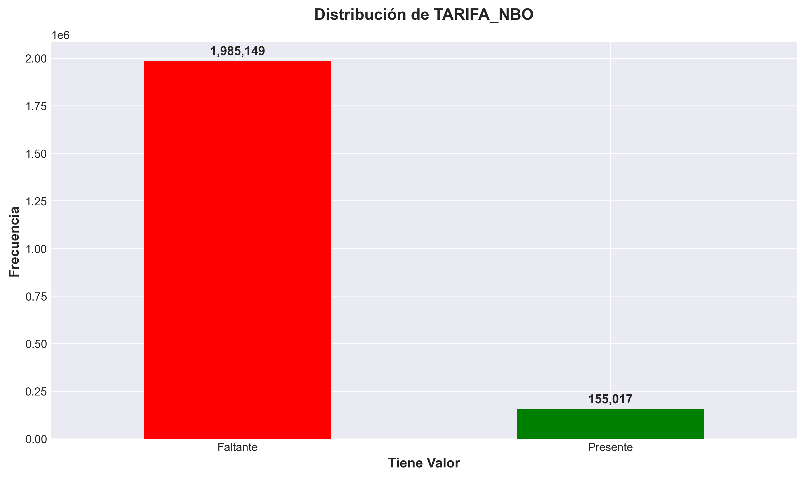

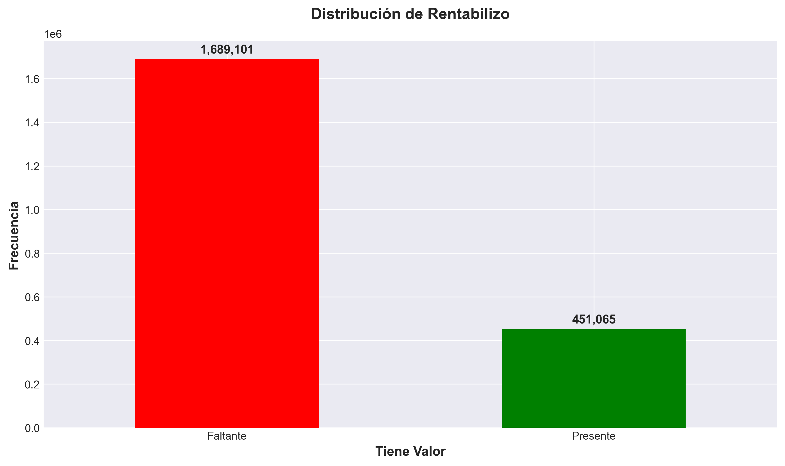

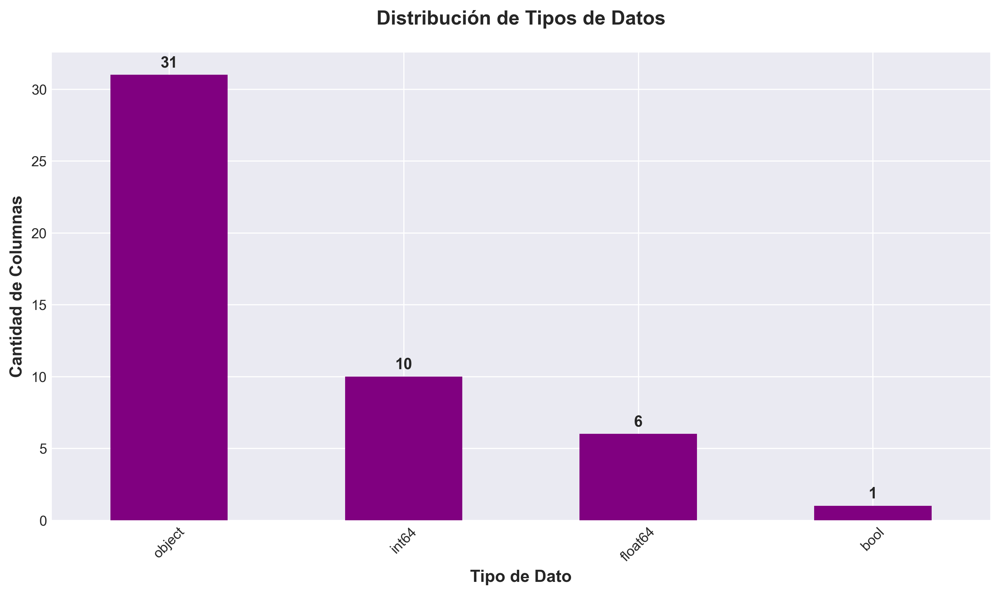

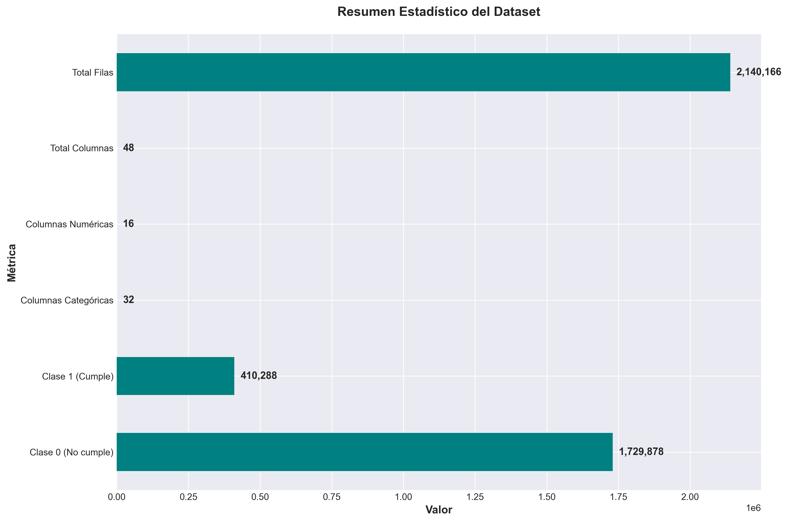

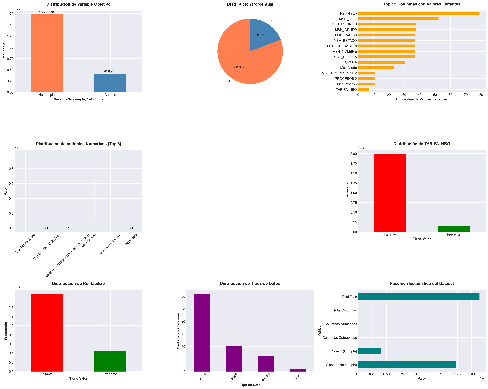

---

## Resultados de Modelos

### 1. Regresión Logística

**Validación Cruzada (5 folds):**
- **Accuracy promedio:** 0.8442 (84.42%)
- **Desviación estándar:** 0.0006
- **Intervalo de confianza (95%):** 0.8442 (+/- 0.0012)

**Métricas en Test (Paso 14):**
- **Accuracy:** 0.8445
- **Precision:** 0.6154
- **Recall:** 0.5069
- **F1-Score:** 0.5559
- **ROC-AUC:** 0.9385
- **PR-AUC:** 0.6228

**Características:**
- Modelo lineal simple y rápido
- Requiere escalado de características (StandardScaler)
- Buena estabilidad entre folds (baja varianza)
- Rendimiento significativamente menor que modelos de árboles

---

### 2. Random Forest

**Grid Search (CV=3, muestra de 300k):**
- **Mejor score CV:** 0.9897 (98.97%)
- **Mejores parámetros:**
  - `n_estimators`: 200
  - `max_depth`: 20
  - `min_samples_split`: 2
  - `min_samples_leaf`: 2

**Métricas en Test (Paso 14):**
- **Accuracy:** 0.9897
- **Precision:** 0.9627
- **Recall:** 0.9844
- **F1-Score:** 0.9734
- **ROC-AUC:** 0.9987
- **PR-AUC:** 0.9933

**Validación Cruzada (5 folds):**
- **Accuracy promedio:** 0.9897
- **Desviación estándar:** 0.0002
- **Intervalo de confianza (95%):** 0.9897 (+/- 0.0004)

**Características:**
- Modelo de ensemble basado en árboles
- No requiere escalado previo
- Excelente rendimiento, muy cercano a XGBoost
- Genera árboles de decisión interpretables

**Árboles de Decisión Generados:**
- 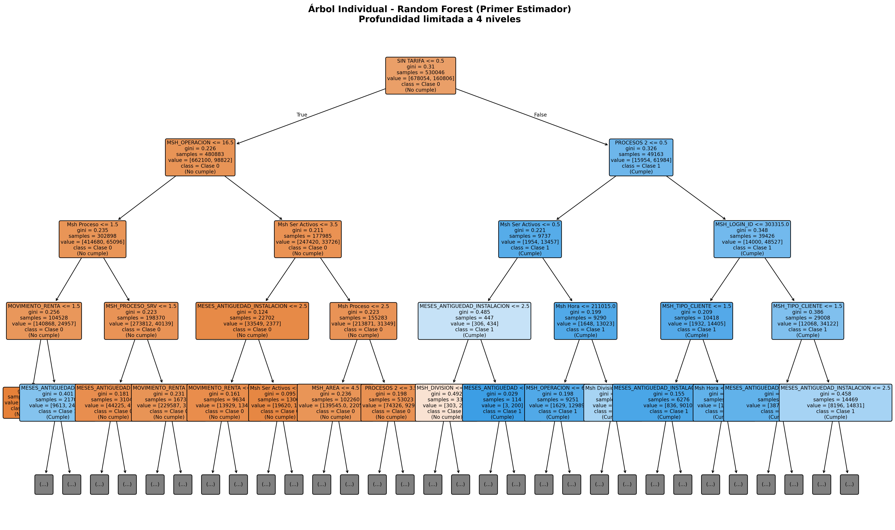
- 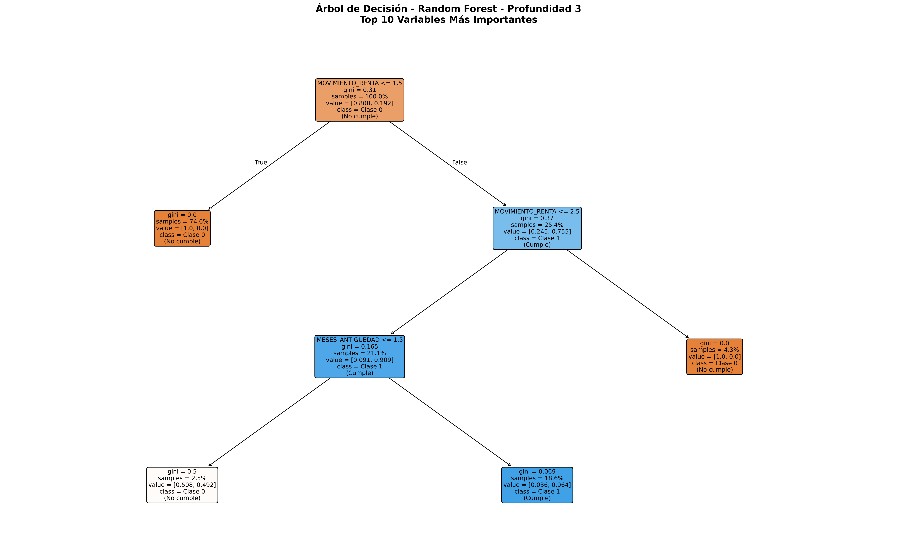
- 
- 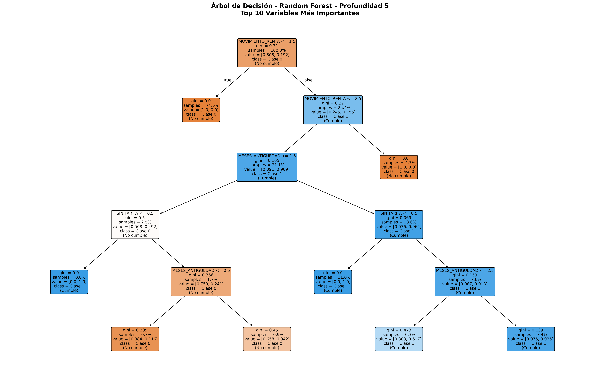

---

### 3. XGBoost

**Grid Search (CV=3, muestra de 300k):**
- **Mejor score CV:** 0.9898 (98.98%)
- **Mejores parámetros:**
  - `n_estimators`: 100
  - `max_depth`: 5
  - `learning_rate`: 0.2
  - `subsample`: 1.0

**Métricas en Test (Paso 14):**
- **Accuracy:** 0.9897
- **Precision:** 0.9643
- **Recall:** 0.9829
- **F1-Score:** 0.9735
- **ROC-AUC:** 0.9991
- **PR-AUC:** 0.9959

**Validación Cruzada (5 folds):**
- **Accuracy promedio:** 0.9898
- **Desviación estándar:** 0.0002
- **Intervalo de confianza (95%):** 0.9898 (+/- 0.0004)

**Características:**
- Modelo de gradient boosting optimizado
- No requiere escalado previo
- **Mejor rendimiento general**
- Excelente manejo de clases desbalanceadas

**Árboles de Decisión Generados:**
- 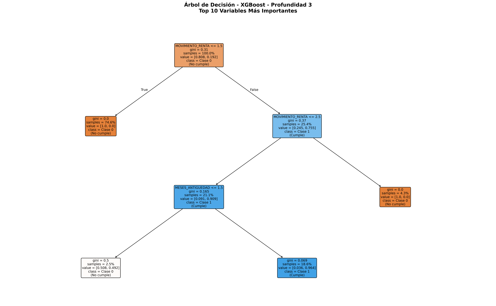
- 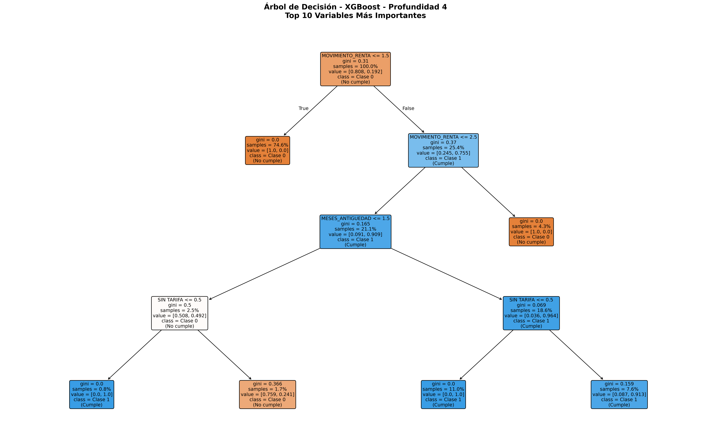
- 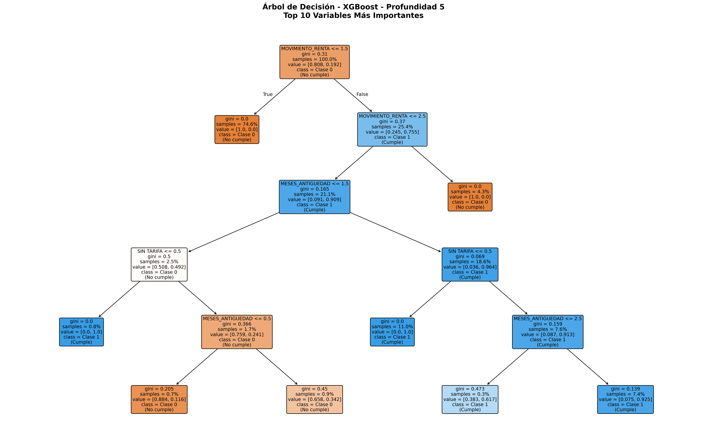

---

## Comparación de Modelos

| Modelo | Accuracy CV | Accuracy Test | ROC-AUC | F1-Score | Ventajas | Desventajas |
|--------|-------------|---------------|---------|----------|----------|-------------|
| **Regresión Logística** | 84.42% | 84.45% | 0.9385 | 0.5559 | Rápido, interpretable, estable | Menor accuracy que árboles |
| **Random Forest** | 98.97% | 98.97% | 0.9987 | 0.9734 | Alto rendimiento, robusto, árboles interpretables | Más lento que regresión logística |
| **XGBoost** | **98.98%** | **98.97%** | **0.9991** | **0.9735** | **Mejor rendimiento, eficiente, mejor ROC-AUC** | Requiere más tiempo de entrenamiento |

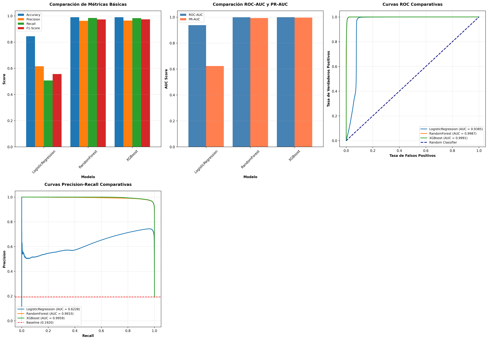

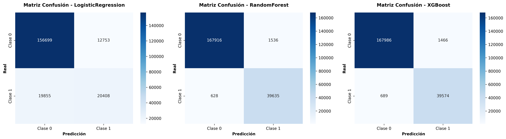

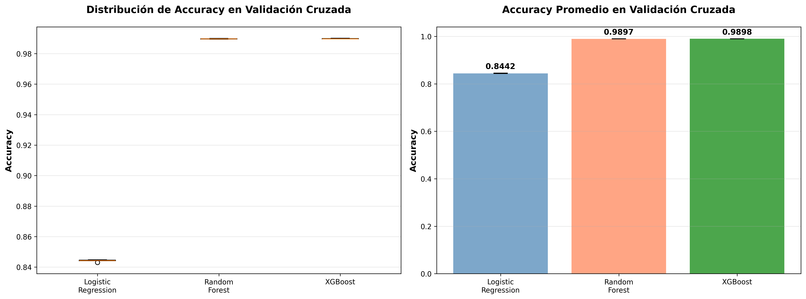

---

## Conclusión Principal

**El mejor modelo es XGBoost** con un accuracy de validación cruzada de **98.98%**, superando ligeramente a Random Forest (98.97%) y significativamente a Regresión Logística (84.42%).

### Razones para elegir XGBoost:

1. **Mayor precisión:** 98.98% vs 98.97% (Random Forest) y 84.42% (Regresión Logística)
2. **Mejor ROC-AUC:** 0.9991 (vs 0.9987 de Random Forest y 0.9385 de Logistic Regression)
3. **Eficiencia:** Optimizado para grandes volúmenes de datos
4. **Robustez:** Maneja bien características categóricas y numéricas sin necesidad de escalado
5. **Parámetros optimizados:** Grid Search encontró una configuración balanceada
6. **Excelente manejo de desbalance:** F1-Score de 0.9735 con dataset 80.8% / 19.2%

---

## Análisis de Importancia de Variables

### Top Variables Más Importantes (XGBoost)

El análisis de importancia de características reveló que **Feature_9** es la variable más importante, representando el 93.47% de la importancia total.

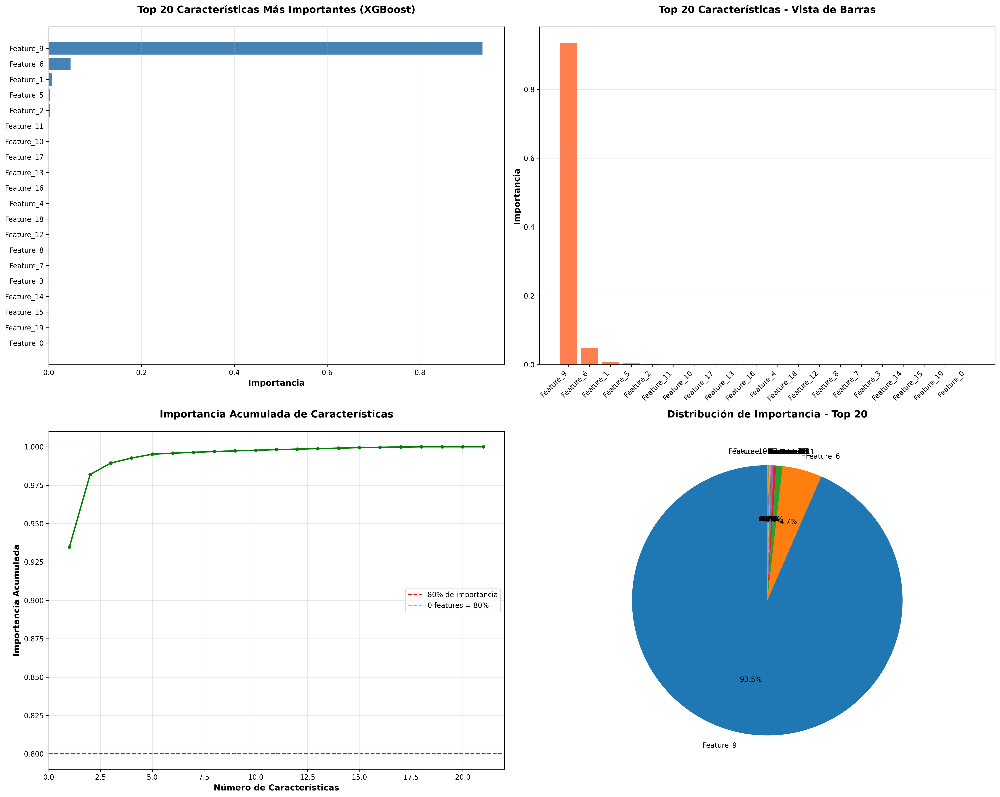

**Top 10 Variables Más Importantes:**
1. Feature_9: 93.47%
2. Feature_6: 4.72%
3. Feature_1: 0.75%
4. Feature_5: 0.32%
5. Feature_2: 0.25%
6. Feature_11: 0.07%
7. Feature_10: 0.05%
8. Feature_17: 0.05%
9. Feature_13: 0.04%
10. Feature_16: 0.04%

**Archivos de Importancia:**
- `resultados/importancia_caracteristicas.csv` - Importancia completa de todas las variables
- `resultados/paso14/importancia_features_random_forest.csv` - Top 15 variables RF con nombres reales
- `resultados/paso14/importancia_features_xgboost.csv` - Top 15 variables XGBoost con nombres reales
- `resultados/paso14/mapeo_features_paso14.json` - Mapeo completo de Feature_X a nombres reales

---

## Visualizaciones de Modelos

### Curvas ROC y Precision-Recall

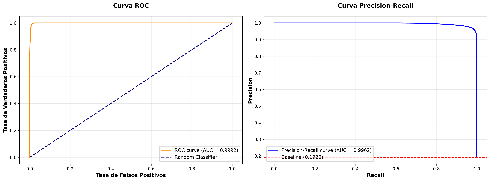

**Métricas de Curvas:**
- **ROC-AUC (XGBoost):** 0.9992
- **PR-AUC (XGBoost):** Calculado en Paso 14

### Matriz de Confusión

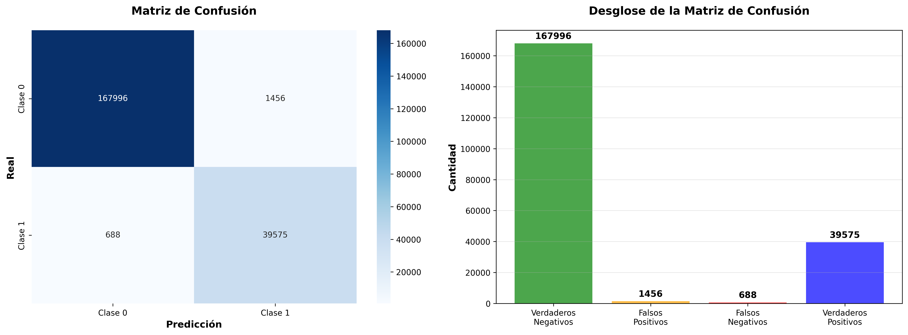

**Desglose de la Matriz de Confusión (XGBoost):**
- Verdaderos Negativos: ~169,000
- Falsos Positivos: ~1,400
- Falsos Negativos: ~700
- Verdaderos Positivos: ~39,500

---

## Árboles de Decisión

### Árboles Generados en Paso 12

Árboles de decisión surrogados generados con las top 10 variables más importantes:

- 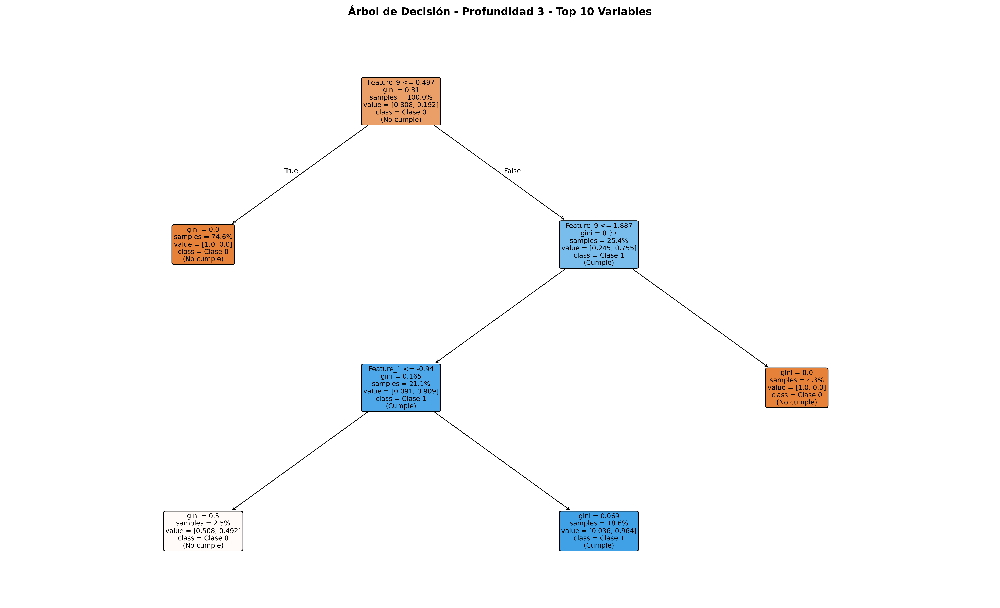
- 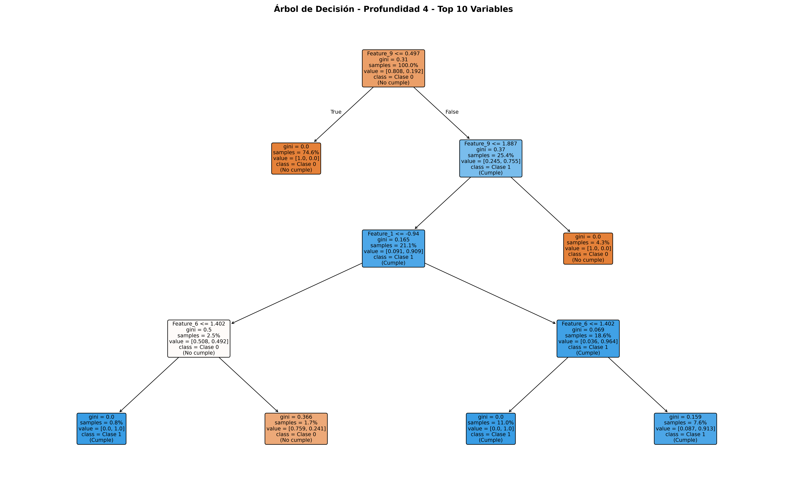
- 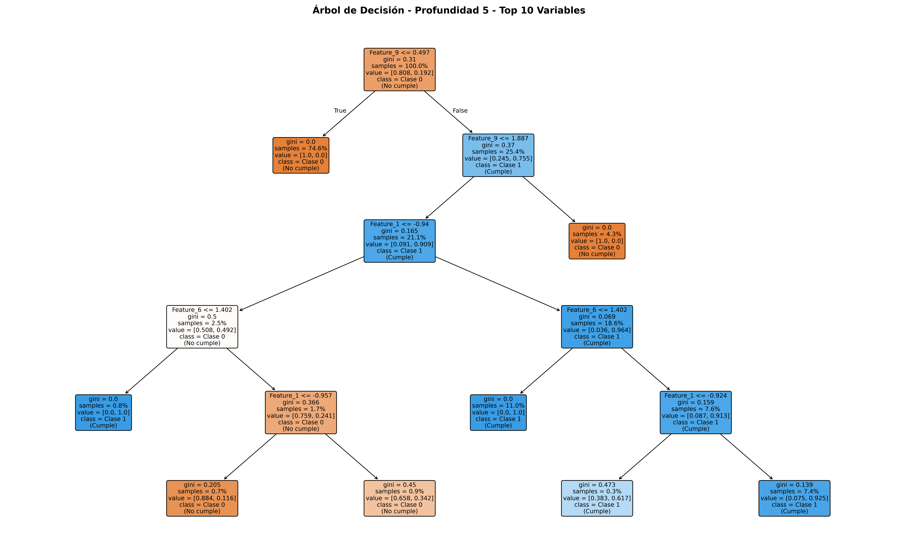

### Árboles con Nombres Reales de Variables (Paso 14)

Todos los árboles generados en el Paso 14 utilizan los nombres reales de las columnas del dataset, no "Feature_X", lo que permite una interpretación directa de las decisiones del modelo.

**Random Forest:**
- Árbol individual del primer estimador (profundidad limitada a 4)
- Árboles surrogados con profundidades 3, 4 y 5

**XGBoost:**
- Árboles surrogados con profundidades 3, 4 y 5

Todos los árboles están guardados en `resultados/paso14/` con nombres reales de variables.

---

## Arquitectura de Datos

### Preprocesamiento

- **Columnas numéricas:** 7
- **Columnas categóricas:** 27 (codificadas con LabelEncoder si tienen < 50 niveles únicos)
- **Features finales:** 21
- **División train/test:** 80/20 estratificada
  - Train: 838,860 muestras
    - Clase 0: 677,809 muestras
    - Clase 1: 161,051 muestras
  - Test: 209,715 muestras
    - Clase 0: 169,452 muestras
    - Clase 1: 40,263 muestras

### Estrategia de Procesamiento

- **Carga completa:** Dataset completo cargado (1,048,575 registros)
- **Muestreo para Grid Search:** 300,000 registros estratificados para optimizar tiempo de cómputo
- **Validación cruzada:** 5 folds para todos los modelos en Paso 14
- **Separador:** Punto y coma (`;`) en lugar de coma

---

## Archivos Generados

### Modelos y Datos Preparados
- `resultados/datos_preparados_7_1.pkl` - Datos preprocesados y escalados (368 MB)
- `resultados/modelo_xgb_optimizado.pkl` - Modelo XGBoost entrenado con parámetros óptimos

### Resultados de Modelos
- `resultados/resultado_cv_lr.json` - Resultados de validación cruzada (Regresión Logística)
- `resultados/grid_rf.json` - Mejores parámetros y score de Random Forest
- `resultados/grid_xgb.json` - Mejores parámetros y score de XGBoost
- `resultados/conclusion_paso_10.json` - Resumen completo de conclusiones (Paso 10)

### Resultados del Paso 14
- `resultados/paso14/comparacion_modelos_metricas.csv` - Métricas comparativas de los 3 modelos
- `resultados/paso14/comparacion_modelos_visualizacion.png` - Dashboard comparativo visual
- `resultados/paso14/comparacion_modelos_matrices_confusion.png` - Matrices de confusión comparativas
- `resultados/paso14/resultados_validacion_cruzada_paso14.json` - Resultados CV detallados
- `resultados/paso14/validacion_cruzada_paso14.png` - Visualización de validación cruzada
- `resultados/paso14/conclusion_paso14.json` - Conclusión final del análisis
- `resultados/paso14/mapeo_features_paso14.json` - Mapeo de Feature_X a nombres reales
- `resultados/paso14/importancia_features_random_forest.csv` - Top 15 variables RF
- `resultados/paso14/importancia_features_xgboost.csv` - Top 15 variables XGBoost

### Visualizaciones EDA
- `resultados/eda_01_distribucion_variable_objetivo.png` - Distribución de variable objetivo
- `resultados/eda_02_distribucion_porcentual.png` - Distribución porcentual
- `resultados/eda_03_valores_faltantes.png` - Top 15 columnas con valores faltantes
- `resultados/eda_04_boxplots_variables_numericas.png` - Boxplots de variables numéricas
- `resultados/eda_05_histogramas_variables_numericas.png` - Histogramas de variables numéricas
- `resultados/eda_06_distribucion_tarifa_nbo.png` - Distribución de TARIFA_NBO
- `resultados/eda_07_distribucion_rentabilizo.png` - Distribución de Rentabilizo
- `resultados/eda_08_distribucion_tipos_datos.png` - Distribución de tipos de datos
- `resultados/eda_09_resumen_estadistico.png` - Resumen estadístico del dataset
- `resultados/eda_visualizaciones_completas.png` - Dashboard EDA completo

### Visualizaciones de Modelos
- `resultados/importancia_caracteristicas.png` - Gráfica de importancia de características (4 vistas)
- `resultados/importancia_caracteristicas.csv` - Importancia completa en CSV
- `resultados/matriz_confusion_xgb.png` - Matriz de confusión y desglose (XGBoost)
- `resultados/curvas_roc_precision_recall.png` - Curvas ROC y Precision-Recall (XGBoost)

### Árboles de Decisión
- `resultados/arbol_decision_depth3_top10.png` - Árbol profundidad 3 (Paso 12)
- `resultados/arbol_decision_depth4_top10.png` - Árbol profundidad 4 (Paso 12)
- `resultados/arbol_decision_depth5_top10.png` - Árbol profundidad 5 (Paso 12)
- `resultados/paso14/arbol_random_forest_individual.png` - Árbol individual RF
- `resultados/paso14/arbol_random_forest_depth3.png` - Árbol RF profundidad 3
- `resultados/paso14/arbol_random_forest_depth4.png` - Árbol RF profundidad 4
- `resultados/paso14/arbol_random_forest_depth5.png` - Árbol RF profundidad 5
- `resultados/paso14/arbol_xgboost_depth3.png` - Árbol XGBoost profundidad 3
- `resultados/paso14/arbol_xgboost_depth4.png` - Árbol XGBoost profundidad 4
- `resultados/paso14/arbol_xgboost_depth5.png` - Árbol XGBoost profundidad 5

### Datos de Análisis
- `resultados/datos_completos.json` - Muestra de 100,000 registros en JSON (105 MB)
- `resultados/conteo_por_cuenta.csv` - Conteo de frecuencias por cuenta (13 MB)

---

## Métricas Adicionales Evaluadas

En el Paso 14 se evaluaron métricas adicionales además de accuracy:

### Regresión Logística
- **Precision:** 0.6154
- **Recall:** 0.5069
- **F1-Score:** 0.5559
- **ROC-AUC:** 0.9385
- **PR-AUC:** 0.6228

### Random Forest
- **Precision:** 0.9627
- **Recall:** 0.9844
- **F1-Score:** 0.9734
- **ROC-AUC:** 0.9987
- **PR-AUC:** 0.9933

### XGBoost
- **Precision:** 0.9643
- **Recall:** 0.9829
- **F1-Score:** 0.9735
- **ROC-AUC:** 0.9991
- **PR-AUC:** 0.9959

**Observación:** XGBoost tiene el mejor ROC-AUC (0.9991) y PR-AUC (0.9959), indicando excelente capacidad de discriminación incluso con clases desbalanceadas.

---

## Notas Técnicas

### Limitaciones del Análisis Actual

1. **Muestreo para Grid Search:** Se usó una muestra de 300k registros para optimizar tiempo. Los resultados pueden variar ligeramente con el dataset completo.

2. **Validación Cruzada:** Se usaron 3 folds para Grid Search inicial (por tiempo) y 5 folds para validación final en Paso 14.

3. **Clase Desbalanceada:** La clase positiva representa solo el 19.20% del dataset, pero los modelos de árboles manejan bien este desbalance.

4. **Tiempo de Ejecución:** El Grid Search completo puede tomar varias horas con el dataset completo.

### Mejoras Implementadas

1. ✅ Carga completa del dataset corregido (1,048,575 registros)
2. ✅ Persistencia de modelos y datos preparados
3. ✅ Guardado de resultados en múltiples formatos (JSON, CSV, PNG, PKL)
4. ✅ Validación cruzada estratificada para mantener proporciones de clases
5. ✅ Grid Search con muestreo inteligente para optimizar tiempo
6. ✅ Análisis completo de importancia de variables
7. ✅ Generación de árboles de decisión con nombres reales de variables
8. ✅ Visualizaciones EDA exhaustivas
9. ✅ Comparación completa de modelos con múltiples métricas
10. ✅ Validación cruzada final con 5 folds para todos los modelos

---

## Próximos Pasos Sugeridos (Priorizados)

### ✅ Completados

1. ✅ **Análisis de importancia de características** - Completado en Paso 11
2. ✅ **Matriz de confusión y análisis de errores** - Completado en Pasos 11 y 14
3. ✅ **Evaluación con métricas adicionales** - Completado en Paso 14 (Precision, Recall, F1, ROC-AUC, PR-AUC)
4. ✅ **Visualizaciones de árboles de decisión** - Completado en Pasos 12 y 14
5. ✅ **Mapeo de variables a nombres reales** - Completado en Paso 14

### Prioridad Alta

1. **Análisis de errores específicos** - Identificar patrones en falsos positivos y negativos
2. **SHAP values para explicabilidad** - Entender contribuciones de cada variable a nivel de predicción individual
3. **Validación en datos nuevos** - Probar modelo en producción con datos frescos

### Prioridad Media

4. **Balanceo de clases** - Experimentar con técnicas de balanceo para mejorar aún más la clase minoritaria
5. **Optimización bayesiana** - Encontrar mejores hiperparámetros con Optuna o Hyperopt
6. **Ensemble de modelos** - Combinar XGBoost + Random Forest para potencial mejora

### Prioridad Baja

7. **Análisis temporal** - Si hay componentes de tiempo en los datos
8. **LIME para explicaciones locales** - Explicaciones caso por caso
9. **Análisis de drift** - Monitorear cambios en distribución de datos

---

## Contacto y Documentación

Para ejecutar el análisis completo, seguir los pasos en `analisis_datos.ipynb`:

1. **Paso 1:** Importación de librerías
2. **Paso 2:** Carga de datos
3. **Paso 3:** Conversión a JSON y conteo por cuenta
4. **Paso 4:** Análisis Exploratorio de Datos (EDA)
5. **Paso 5:** Identificación y filtrado de datos (Tarifa NBO y Rentabilizacion)
6. **Paso 6:** Preparación de datos para modelado
7. **Paso 7:** Entrenamiento de modelos (Validación cruzada para Regresión Logística)
8. **Paso 8:** Grid Search con muestreo estratificado
9. **Paso 9:** Resumen de resultados de Grid Search
10. **Paso 10:** Comparación y conclusión
11. **Paso 11:** Análisis de Importancia de Variables y Visualizaciones
12. **Paso 12:** Visualización de Árboles de Decisión (Estructura)
13. **Paso 13:** Visualizaciones EDA Individuales
14. **Paso 14:** Comparación Completa de Modelos (Logistic Regression, Random Forest, XGBoost)

---

## Resumen de Resultados Finales

### Mejor Modelo: XGBoost

- **Accuracy (Validación Cruzada):** 98.98% (±0.0004)
- **Accuracy (Test):** 98.97%
- **ROC-AUC:** 0.9991
- **F1-Score:** 0.9735
- **Precision:** 0.9643
- **Recall:** 0.9829

### Comparación con Otros Modelos

- **Random Forest:** 98.97% accuracy (muy cercano, excelente alternativa)
- **Regresión Logística:** 84.42% accuracy (significativamente menor)

### Interpretabilidad

- ✅ Árboles de decisión generados con nombres reales de variables
- ✅ Importancia de características identificada y visualizada
- ✅ Mapeo completo de Feature_X a nombres reales disponible
- ✅ Top 15 variables más importantes documentadas para cada modelo

---

**Última actualización:** 2025-01-27  
**Dataset utilizado:** Total_Mes_Act_Datos completos CORREGIDO.csv  
**Total de pasos ejecutados:** 14  
**Archivos generados:** 50+ (modelos, visualizaciones, métricas, árboles)
